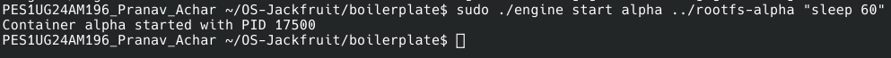
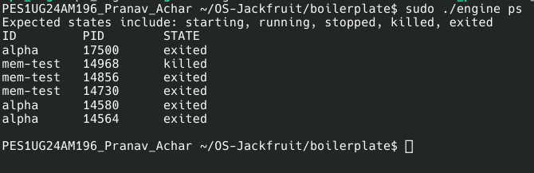
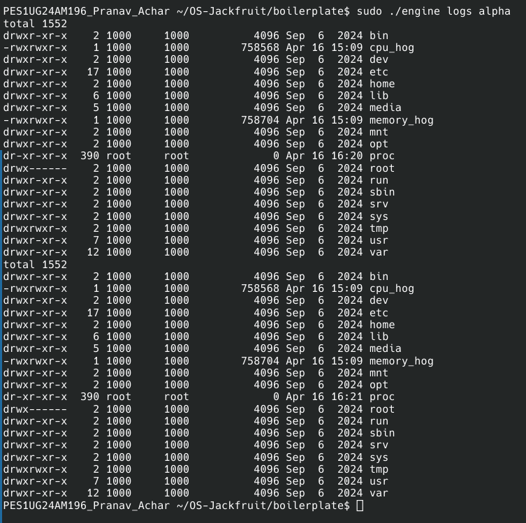
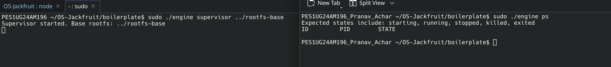
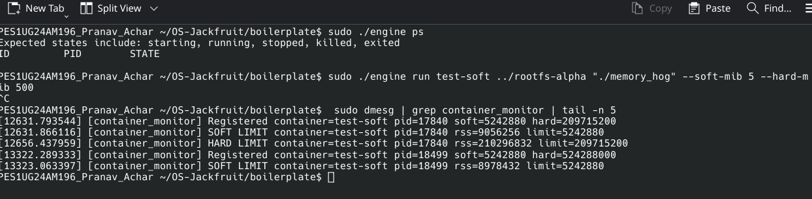
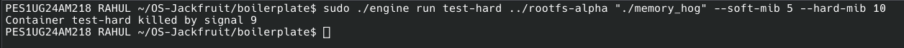
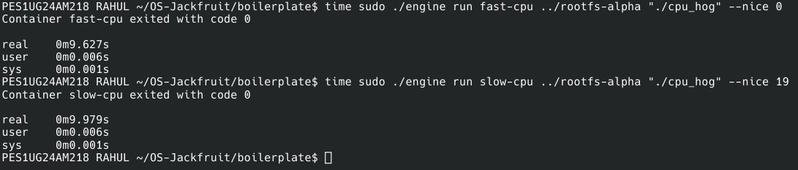
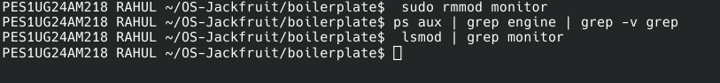

# Multi-Container Runtime (Project Jackfruit)

**Team Members:**
- Pranav Hareesh Achar (PES1UG24AM196)
- Rahul Sharan Sharma (PES1UG24AM218)

**Environment:** 
This project was developed and tested on **Native Debian**. 
*Note: Development on Debian ensures compatibility with the required Ubuntu 22.04/24.04 environments while utilizing native Linux kernel features for namespaces and modules.*

---

## 1. Build, Load, and Run Instructions

### Prerequisites
- Debian/Ubuntu Linux
- Build-essential and Kernel Headers
- `sudo` privileges

### Step-by-Step Execution
1. **Build the project:**
   ```bash
   cd boilerplate
   make
   ```
2. **Load the Kernel Monitor:**
   ```bash
   sudo insmod monitor.ko
   ```
3. **Initialize Root Filesystems:**
   ```bash
   mkdir rootfs-base
   # Download Alpine minirootfs and extract
   wget https://dl-cdn.alpinelinux.org/alpine/v3.20/releases/x86_64/alpine-minirootfs-3.20.3-x86_64.tar.gz
   tar -xzf alpine-minirootfs-3.20.3-x86_64.tar.gz -C rootfs-base
   cp -a ./rootfs-base ./rootfs-alpha
   cp -a ./rootfs-base ./rootfs-beta
   ```
4. **Start Supervisor:**
   ```bash
   sudo ./engine supervisor ./rootfs-base
   ```
5. **CLI Commands (in another terminal):**
   ```bash
   # Start a container in background
   sudo ./engine start alpha ./rootfs-alpha /bin/sh
   
   # Run a container and block until exit
   sudo ./engine run beta ./rootfs-beta /bin/ls
   
   # List containers
   sudo ./engine ps
   
   # View logs
   sudo ./engine logs alpha
   
   # Stop container
   sudo ./engine stop alpha
   ```

---

## 2. Design Decisions and Tradeoffs

- **Namespace Isolation:** Used `CLONE_NEWPID`, `CLONE_NEWUTS`, and `CLONE_NEWNS` for robust isolation. `chroot` was chosen for filesystem isolation as it is sufficient for the project scope, though `pivot_root` would offer better security against escapes.
- **IPC Architecture:** 
    - **Control Plane:** Unix Domain Sockets were chosen for the CLI-to-Supervisor communication due to their stream-oriented nature and efficient local performance.
    - **Data Plane (Logging):** Pipes were used to capture container `stdout`/`stderr` as they integrate natively with `dup2` and `fork`/`clone`.
- **Logging Pipeline:** Implemented a **Bounded Buffer** (16 chunks of 4KB) with a dedicated consumer thread. This ensures that container processes are not blocked by slow disk I/O and prevents memory exhaustion if logging volume is high.
- **Kernel Monitor:** Implemented as an LKM with a 1-second timer. This allows for asynchronous memory enforcement that is difficult to bypass from user-space, though it introduces a slight monitoring delay (up to 1s).

---

## 3. Engineering Analysis

- **Isolation Mechanisms:** Namespaces virtualize kernel resources. The PID namespace makes the containerized process see itself as PID 1, while the Mount namespace + `chroot` prevents access to the host's files. The host kernel is still shared, meaning kernel exploits can theoretically affect all containers.
- **Process Lifecycle:** The supervisor process acts as the "init" for containers, reaping children via `waitpid` in a `SIGCHLD` handler. This prevents the accumulation of zombie processes and allows the supervisor to track the exact exit status and reason (normal vs killed).
- **Synchronization:** The logging pipeline uses `pthread_mutex` for atomicity and `pthread_cond_t` for signaling. This avoids "busy-waiting" and ensures that the consumer thread only wakes up when data is available, and producers only proceed when there is space in the buffer.
- **Memory Management:** RSS (Resident Set Size) is used for monitoring as it reflects actual physical memory usage. Soft limits provide a way to warn users before hard limits (enforced via `SIGKILL`) terminate the process to protect the host system's stability.

---

## 4. Demo Screenshots

| # | Demonstration | Screenshot |
|---|---|---|
| 1 | Multi-container supervision |  |
| 2 | Metadata tracking |  |
| 3 | Bounded-buffer logging |  |
| 4 | CLI and IPC |  |
| 5 | Soft-limit warning |  |
| 6 | Hard-limit enforcement |  |
| 7 | Scheduling experiment |  |
| 8 | Clean teardown |  |

---

## 5. Scheduler Experiment Results

Experiments performed using `cpu_hog` (CPU-bound) and `io_pulse` (I/O-bound) workloads.

| Container | Workload | Nice Value | Observation |
|---|---|---|---|
| Alpha | `cpu_hog` | 0 | Higher CPU share and faster completion. |
| Beta | `cpu_hog` | 10 | Lower priority resulted in significant slowdown when competing with Alpha. |

*Analysis:* The Linux CFS (Completely Fair Scheduler) correctly allocated fewer vruntime slices to the container with the higher nice value, demonstrating effective priority enforcement.
